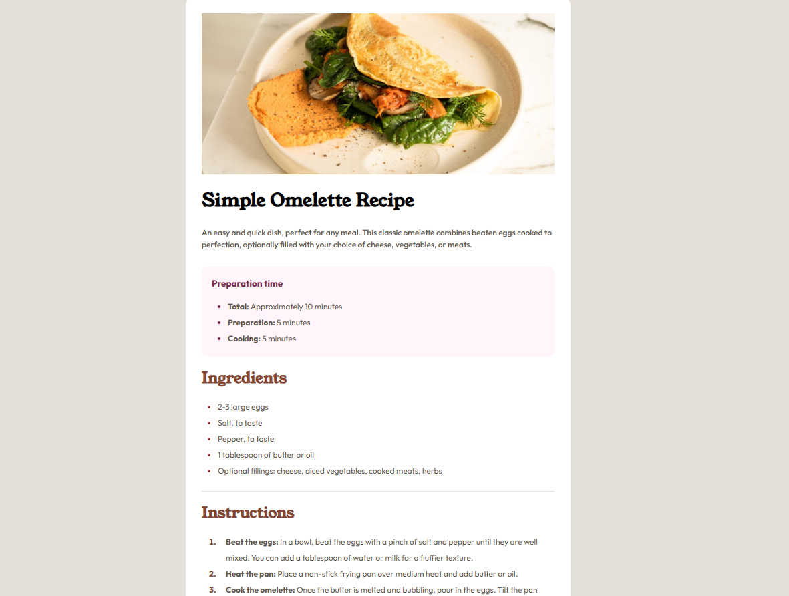
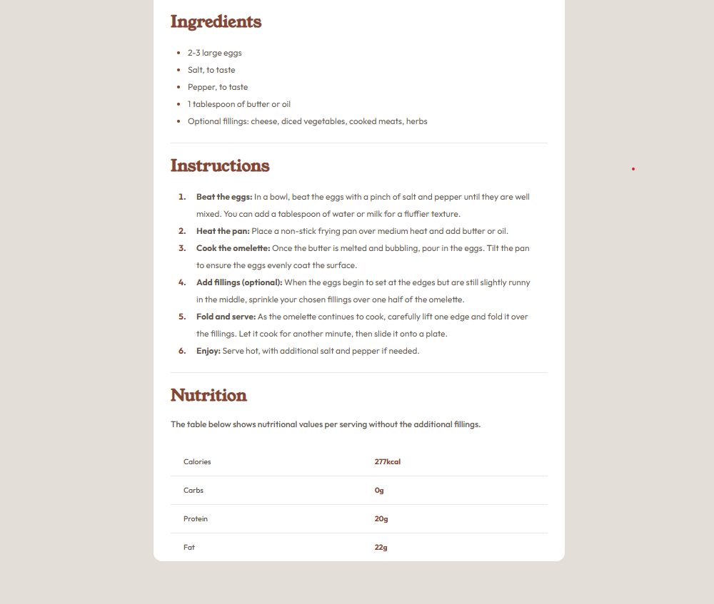
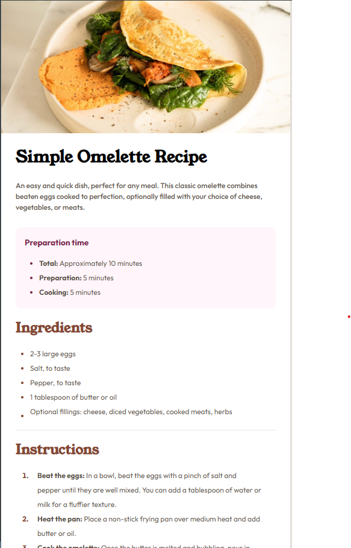
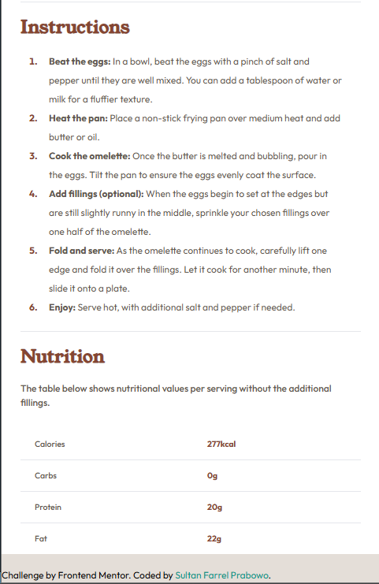

# Frontend Mentor - Recipe page solution

This is a solution to the [Recipe page challenge on Frontend Mentor](https://www.frontendmentor.io/challenges/recipe-page-KiTsR8QQKm). Frontend Mentor challenges help you improve your coding skills by building realistic projects. 

## Table of contents

- [Overview](#overview)
  - [Screenshot](#screenshot)
  - [Links](#links)
  - [Built with](#built-with)
- [Author](#author)

## Overview
Simple Omelette Recipe Page

This project is a web-based recipe page focused on guiding users through the preparation of a classic omelette. The page is designed to be clean, simple, and user-friendly, providing all the necessary information for making an omelette in an organized and visually appealing format.

Features:
Preparation Time: Displays the total, preparation, and cooking times for the recipe, allowing users to plan accordingly.
Ingredients: Lists all the required ingredients, including optional fillings, so users can prepare the omelette according to their preferences.
Instructions: Step-by-step guidance is provided to ensure even beginners can follow along easily and make the perfect omelette.
Nutrition Information: Offers a breakdown of the nutritional content, helping users to understand the health benefits of the dish.
This page was created using modern web technologies, focusing on clear structure and accessibility. The design is responsive, ensuring compatibility across different devices and screen sizes.

Feel free to explore, modify, and use this project as a starting point for your own culinary web projects.
### Screenshot

### Links

- Solution URL: [https://www.frontendmentor.io/solutions/simple-omelette-recipe-page-with-tailwind-css-8PYNOVygiw](https://www.frontendmentor.io/solutions/simple-omelette-recipe-page-with-tailwind-css-8PYNOVygiw)
- Live Site URL: [https://sultanfarrel.github.io/recipe-page-main/](https://your-live-site-url.com](https://sultanfarrel.github.io/recipe-page-main))

### Built with

- Semantic HTML5 markup
- Tailwind CSS
- Flexbox
- Mobile-first workflow

## Author

- Website - [Sultan Farrel](https://www.sultanf.my.id)
- Frontend Mentor - [@SultanFarrel](https://www.frontendmentor.io/profile/SultanFarrel)
- Instagram - [@farrelsultan15](https://www.instagram.com/farrelsultan15)
